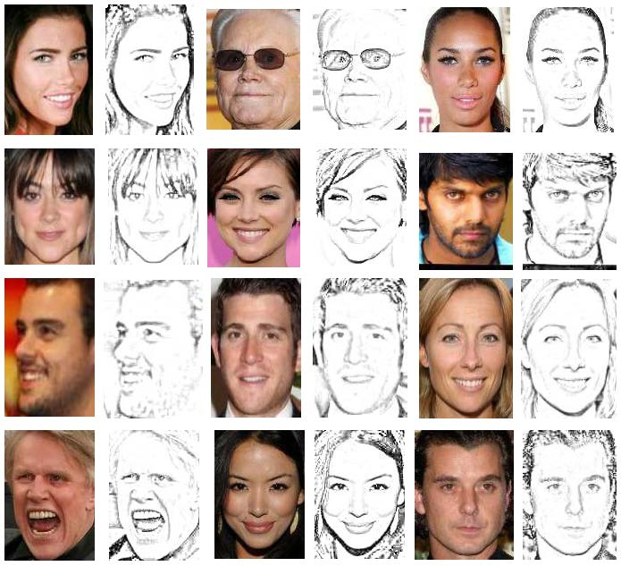

# HFIR
Heterogeneous Face Interpretable Representation for Joint Face Recognition and Synthesis

The paper is under review. 
We will realse the code and new face sketch database in the future.

## Requirements
- Python 3.6
- pytorch
- CUDA & GPU available device

## Dataset

We build the corresponding face sketches to face photos in CelebA database.
The introduced large-scale CelebA-sketch database contains
200k photo-sketch pairs belong to 10k number of identities.

## Experiments
### Two-Modality Heterogeneous Face Interpolation

Example of face synthesis by linear interpolation of two modality factors. We fix the latent identity part and modality the modality part value.

### Multi-Modality Heterogeneous Face Interpolation

Example of face synthesis by linear interpolation of multiple modality factors. We fix the latent identity part and modality the modality part value.

## Citation

